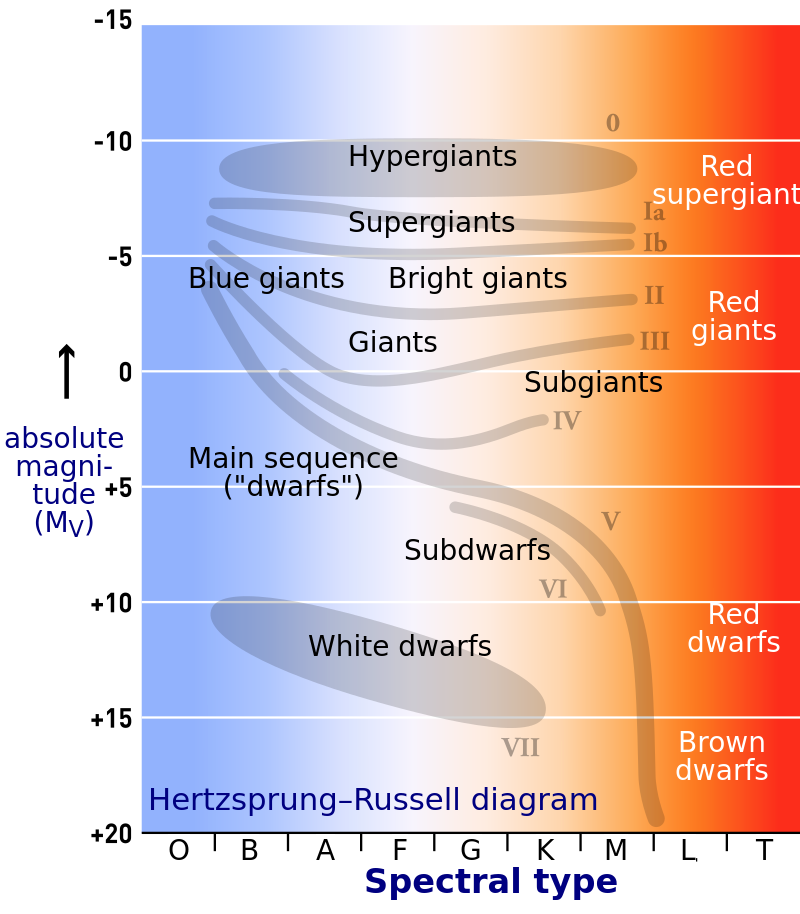

# Star Type Classifcation

Data set taken from [Kaggle](https://www.kaggle.com/brsdincer/star-type-classification)

The dataset is for the classification of different stars based on: 
* Temperature
* Relative Luminosity, L -> light emitted from surface
* Relative Radius, R -> size relative to our sun
* Absolute magnitude, A_M -> 
* Spectral Class -> O, B, A, F, G, K, M
* Color

The different types of star, the classification, are encoded to the values:
* Red Dwarf, 0
* Brown Dwarf, 1
* White Dwarf, 2
* Main Sequence, 3
* Super Giants, 4
* Hyper Giants, 5
